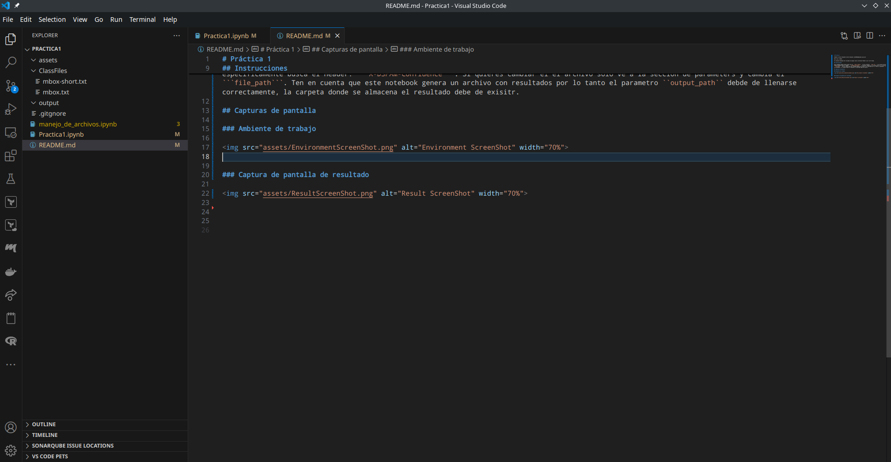
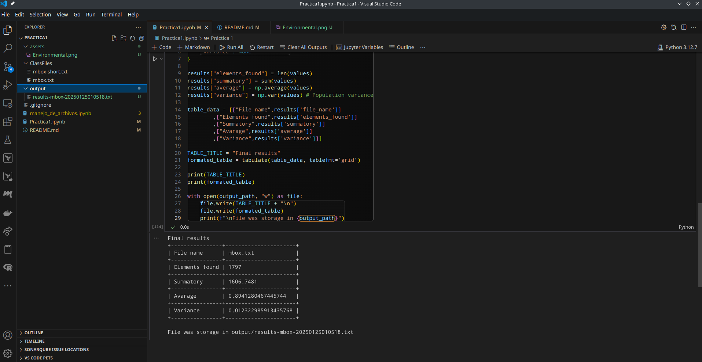

# Práctica 1 

Elaboró: Carlos Alejandro Jarero Gonzalez <al255813@alumnos.uacj.mx>

Matrícula: 255813

El presente Notebook fue relizado en equipo local con Kernel Python 3.12.7 en VS Code.

## Instrucciones

Este notebook puede extraer datos de los ```email headers``` de los archivos ```mbox.txt``` y su versión acortada ```mbox-short.txt```, especificamente busca el Header: ```X-DSPAM-Confidence```. Si quieres cambiar el el archivo solo ve a la sección de parameters y cambia el ```file_path```. Ten en cuenta que este notebook genera un archivo con resultados por lo tanto el parametro ``output_path`` debde de llenarse correctamente, la carpeta donde se almacena el resultado debe de exisitr.

## Capturas de pantalla

### Ambiente de trabajo




### Captura de pantalla de resultado




